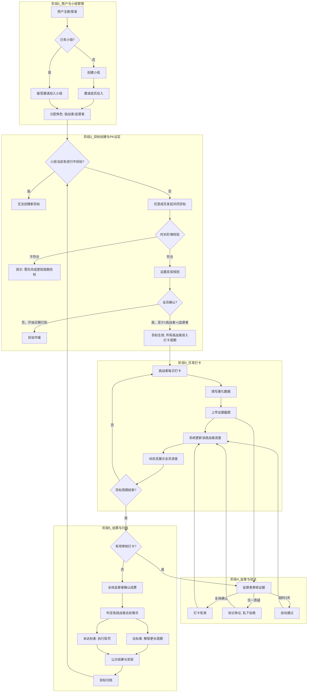
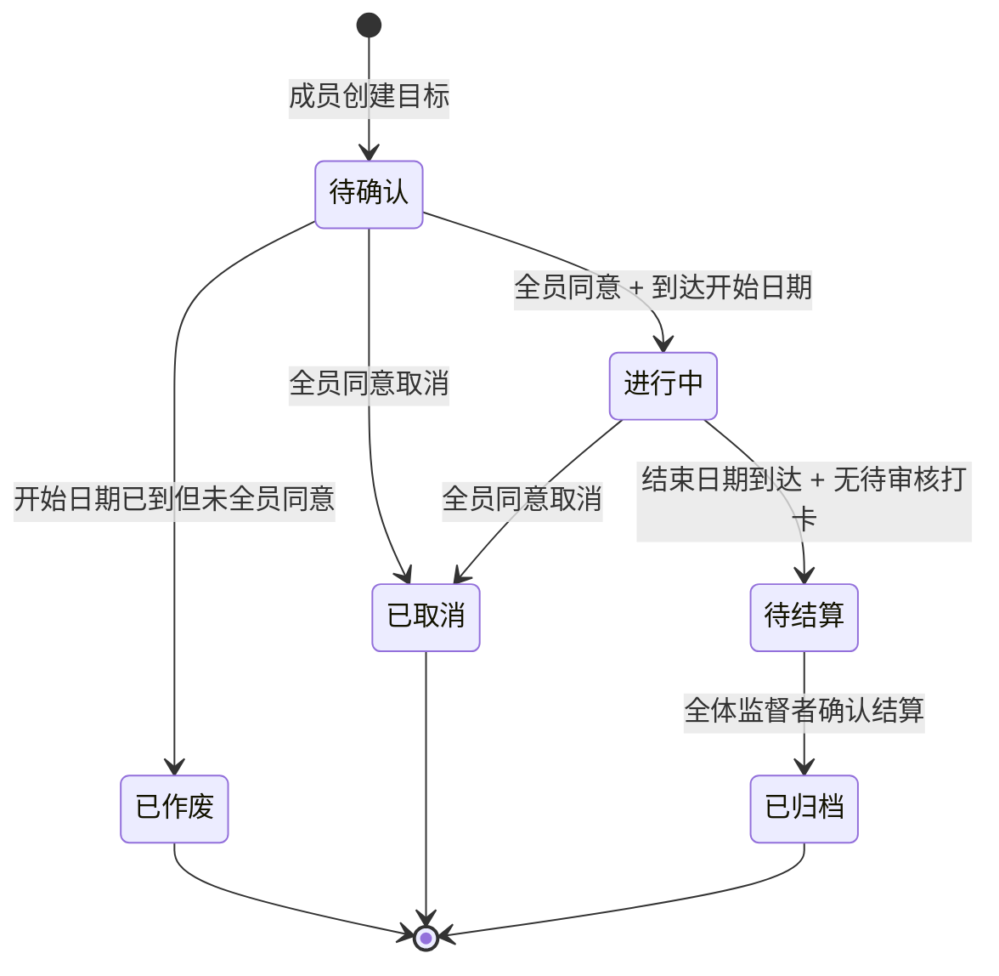
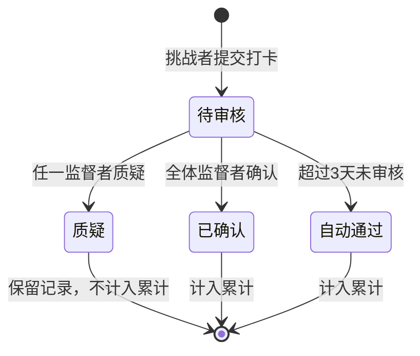

# 产品需求文档：社交监督式打卡与PK系统 - V1.0

## 1. 综述 (Overview)

### 1.1 项目背景与核心问题

**背景**：一群朋友希望通过相互监督来养成习惯、完成目标（如每月跑步60公里）。他们目前使用微信群接龙的方式进行打卡，但存在以下痛点：

1. **信息混乱，难以追踪**：接龙信息淹没在聊天记录中，查看个人进度、统计总数需要手动爬楼计算
2. **流程与规则靠人力维护**：目标时长升级规则、奖惩规则完全依赖个人记忆和手动记录
3. **验证流程不系统**：证据截图散落在聊天中，缺乏集中的审核入口

**核心定位**：一个轻量级、可自定义、具有社交监督与惩罚/奖励机制的打卡平台，用于帮助小团体（2-6人）坚持完成长期目标。

**用户角色**：
- **挑战者**：设定并执行目标的参与者，需要每日打卡
- **监督者**：不参与挑战，负责审核证据、确认打卡有效性，增加游戏性和公信力

### 1.2 核心业务流程 / 用户旅程地图

1. **阶段一：用户与小组管理** — 注册/登录、创建小组、邀请成员加入（邀请制，上限6人）、角色分配
2. **阶段二：目标创建与PK设定** — 任意成员创建共同目标（含时长阶梯限制）、设置奖惩规则、全员确认
3. **阶段三：日常打卡与证据提交** — 挑战者每日打卡、填写量化数据、上传证据截图、查看进度与动态
4. **阶段四：监督与验证** — 监督者审核证据、确认/质疑打卡记录
5. **阶段五：结算与归档** — 目标到期后结算、判定达标情况、更新时长阶梯、归档历史

### 1.3 Mermaid 图（流程/状态/时序）

#### 1.3.1 用户操作流（核心流程）

#### 1.3.2 目标状态机

#### 1.3.3 打卡记录状态机

---

## 2. 用户故事详述 (User Stories)

### 阶段一：用户与小组管理

---

#### **US-01: 作为新用户，我希望能注册账号，以便使用打卡系统**

*   **价值陈述 (Value Statement)**:
    *   **作为** 新用户
    *   **我希望** 注册一个账号
    *   **以便于** 使用打卡系统的所有功能

*   **业务规则与逻辑 (Business Logic)**:
    1.  **前置条件**: 无（自由注册）
    2.  **操作流程 (Happy Path)**:
        1. 用户进入注册页面
        2. 填写用户名、密码、昵称
        3. 点击"注册"按钮
        4. 系统校验通过后创建账号
        5. 跳转至登录页或自动登录
    3.  **异常处理 (Error Handling)**:
        * 用户名已存在 → 提示"用户名已被占用"
        * 昵称已存在 → 提示"昵称已被占用"
        * 用户名格式不符 → 提示"用户名需为3-20位英文或数字"
        * 密码格式不符 → 提示"密码需为8-20位"
        * 昵称格式不符 → 提示"昵称需为1-10字符（中文=1，英文/数字=0.5）"

*   **字段规则**:
    | 字段 | 规则 |
    |------|------|
    | 用户名 | 3-20字符，仅允许英文+数字，全局唯一 |
    | 密码 | 8-20位，无复杂度要求 |
    | 昵称 | 1-10字符（中文=1字符，英文/数字=0.5字符），全局唯一 |

*   **验收标准 (Acceptance Criteria)**:
    *   **场景1: 成功注册**
        *   **GIVEN** 我填写了符合规则的用户名、密码、昵称
        *   **WHEN** 我点击"注册"
        *   **THEN** 系统创建账号，跳转至登录页或自动登录
    *   **场景2: 用户名已存在**
        *   **GIVEN** 我填写的用户名已被其他用户注册
        *   **WHEN** 我点击"注册"
        *   **THEN** 系统提示"用户名已被占用"，注册失败
    *   **场景3: 昵称已存在**
        *   **GIVEN** 我填写的昵称已被其他用户使用
        *   **WHEN** 我点击"注册"
        *   **THEN** 系统提示"昵称已被占用"，注册失败

---

#### **US-02: 作为已注册用户，我希望能登录系统，以便使用打卡功能**

*   **价值陈述 (Value Statement)**:
    *   **作为** 已注册用户
    *   **我希望** 登录系统
    *   **以便于** 使用打卡功能

*   **业务规则与逻辑 (Business Logic)**:
    1.  **前置条件**: 用户已完成注册
    2.  **操作流程 (Happy Path)**:
        1. 用户进入登录页面
        2. 填写用户名、密码
        3. 可选勾选"记住我"
        4. 点击"登录"按钮
        5. 系统校验通过后进入首页
    3.  **异常处理 (Error Handling)**:
        * 用户名不存在或密码错误 → 提示"用户名或密码错误"（不区分具体原因）
        * 密码错误无次数限制

*   **功能说明**:
    | 功能 | 说明 |
    |------|------|
    | 记住我 | 勾选后下次访问自动登录 |
    | 忘记密码 | 不提供（注册时未绑定手机号/邮箱） |

*   **验收标准 (Acceptance Criteria)**:
    *   **场景1: 成功登录**
        *   **GIVEN** 我输入正确的用户名和密码
        *   **WHEN** 我点击"登录"
        *   **THEN** 系统进入首页
    *   **场景2: 登录失败**
        *   **GIVEN** 我输入错误的用户名或密码
        *   **WHEN** 我点击"登录"
        *   **THEN** 系统提示"用户名或密码错误"
    *   **场景3: 记住我**
        *   **GIVEN** 我勾选"记住我"并成功登录
        *   **WHEN** 我关闭浏览器后再次访问
        *   **THEN** 系统自动登录，直接进入首页

---

#### **US-03: 作为已登录用户，我希望能创建小组，以便组织朋友一起打卡**

*   **价值陈述 (Value Statement)**:
    *   **作为** 已登录用户
    *   **我希望** 创建一个小组
    *   **以便于** 组织朋友一起打卡

*   **业务规则与逻辑 (Business Logic)**:
    1.  **前置条件**: 用户已登录
    2.  **操作流程 (Happy Path)**:
        1. 用户点击"创建小组"
        2. 填写小组名称（必填）、小组简介（选填）
        3. 选择自己在小组中的角色（挑战者/监督者）
        4. 点击"创建"
        5. 系统创建小组，自动生成5个一次性邀请码
        6. 创建者以所选角色加入小组
    3.  **异常处理 (Error Handling)**:
        * 小组名称不符合规则 → 提示"小组名称需为2-20字符（中文=1，英文/数字=0.5）"

*   **字段规则**:
    | 字段 | 规则 |
    |------|------|
    | 小组名称 | 2-20字符（中文=1，英文/数字=0.5），可与其他小组重名 |
    | 小组简介 | 不超过100字符，选填 |
    | 小组人数上限 | 6人（含监督者） |

*   **其他规则**:
    * 一个用户可创建多个小组
    * 一个用户可同时属于多个小组

*   **验收标准 (Acceptance Criteria)**:
    *   **场景1: 成功创建小组**
        *   **GIVEN** 我填写了符合规则的小组名称并选择角色
        *   **WHEN** 我点击"创建"
        *   **THEN** 系统创建小组，我以所选角色加入，系统生成5个邀请码
    *   **场景2: 小组名称不符合规则**
        *   **GIVEN** 我填写的小组名称超过20字符
        *   **WHEN** 我点击"创建"
        *   **THEN** 系统提示"小组名称需为2-20字符"，创建失败

---

#### **US-04: 作为小组成员，我希望能邀请朋友加入小组，以便一起打卡**

*   **价值陈述 (Value Statement)**:
    *   **作为** 小组成员
    *   **我希望** 邀请朋友加入小组
    *   **以便于** 一起打卡

*   **业务规则与逻辑 (Business Logic)**:
    1.  **前置条件**: 用户已登录，且属于某个小组
    2.  **操作流程 (Happy Path) - 邀请方**:
        1. 用户查看小组详情
        2. 查看/复制未使用的邀请码
        3. 私下分享给朋友（微信、短信等）
    3.  **操作流程 (Happy Path) - 被邀请方**:
        1. 用户登录系统
        2. 输入邀请码
        3. 选择角色（挑战者/监督者）
        4. 点击"加入"
        5. 系统校验通过后加入小组
        6. 若小组有进行中的目标，且角色为挑战者，自动参与当前目标
    3.  **异常处理 (Error Handling)**:
        * 邀请码无效或已使用 → 提示"邀请码无效"
        * 小组已满6人 → 提示"小组已满，无法加入"
        * 用户已在该小组 → 提示"您已是该小组成员"

*   **邀请码规则**:
    | 规则 | 说明 |
    |------|------|
    | 生成时机 | 小组创建时自动生成5个 |
    | 有效期 | 永久有效 |
    | 使用次数 | 每个邀请码仅能使用一次，用完作废 |
    | 通知方式 | 系统内不发送通知，需私下分享 |

*   **验收标准 (Acceptance Criteria)**:
    *   **场景1: 成功加入小组**
        *   **GIVEN** 我输入有效的邀请码并选择角色
        *   **WHEN** 我点击"加入"
        *   **THEN** 系统将我加入小组，邀请码作废
    *   **场景2: 邀请码已使用**
        *   **GIVEN** 我输入已被使用的邀请码
        *   **WHEN** 我点击"加入"
        *   **THEN** 系统提示"邀请码无效"
    *   **场景3: 小组已满**
        *   **GIVEN** 小组已有6人，我输入有效邀请码
        *   **WHEN** 我点击"加入"
        *   **THEN** 系统提示"小组已满，无法加入"
    *   **场景4: 加入时有进行中目标**
        *   **GIVEN** 小组有进行中的目标，我以挑战者身份加入
        *   **WHEN** 加入成功
        *   **THEN** 我自动成为当前目标的参与者

---

### 阶段二：目标创建与PK设定

---

#### **US-05: 作为小组成员，我希望能创建共同目标，以便大家一起挑战**

*   **价值陈述 (Value Statement)**:
    *   **作为** 小组成员
    *   **我希望** 创建一个共同目标
    *   **以便于** 大家一起挑战

*   **业务规则与逻辑 (Business Logic)**:
    1.  **前置条件**: 用户已登录，属于某个小组，该小组当前无进行中/待确认的目标
    2.  **操作流程 (Happy Path)**:
        1. 任意成员（挑战者或监督者）发起创建目标
        2. 填写目标信息：名称、类别、达标条件（数值+单位）、开始日期、结束日期、奖惩规则、证据要求
        3. 系统校验时长阶梯限制
        4. 校验通过后，目标进入"待确认"状态
        5. 通知全体成员确认
        6. 全员同意 + 至少1位挑战者 + 至少1位监督者 + 开始日期前确认完成 → 目标生效
    3.  **异常处理 (Error Handling)**:
        * 小组已有进行中/待确认目标 → 提示"当前已有进行中的目标"
        * 时长超出可解锁上限 → 提示"您当前最长可创建X个月的[类别]目标"
        * 开始日期是当天或过去 → 提示"开始日期必须是未来日期"
        * 到达开始日期未全员同意 → 目标自动作废，通知全员
        * 全员同意但无挑战者 → 提示"至少需要1位挑战者"
        * 全员同意但无监督者 → 提示"至少需要1位监督者"

*   **目标字段**:
    | 字段 | 说明 |
    |------|------|
    | 目标名称 | 如"12月跑步挑战" |
    | 目标类别 | 自定义，如"跑步"、"读书" |
    | 达标条件 | 数值 + 单位，如"60公里" |
    | 开始日期 | 必须是未来日期（不能是当天） |
    | 结束日期 | 受时长阶梯限制 |
    | 奖惩规则 | 自由文本，如"失败者请成功者吃饭" |
    | 证据要求 | 自由文本，如"跑步APP截图" |

*   **时长阶梯规则（针对同类目标）**:
    | 完成次数 | 可解锁最长周期 |
    |----------|----------------|
    | 0次（首次） | 1个月 |
    | 1次 | 2个月 |
    | 2次 | 3个月 |
    | 4次 | 6个月 |
    | 6次 | 12个月 |

    **特别说明**：创建目标时的时长限制，取所有挑战者中可解锁周期最短的。

*   **验收标准 (Acceptance Criteria)**:
    *   **场景1: 成功创建并生效**
        *   **GIVEN** 小组无进行中目标，我填写符合规则的目标信息
        *   **WHEN** 全员在开始日期前同意，且有至少1位挑战者和1位监督者
        *   **THEN** 目标在开始日期生效，所有挑战者进入打卡周期
    *   **场景2: 时长超限**
        *   **GIVEN** 小组中某挑战者首次创建"跑步"类目标
        *   **WHEN** 我设置目标周期为2个月
        *   **THEN** 系统提示"您当前最长可创建1个月的跑步目标"
    *   **场景3: 开始日期前未全员同意**
        *   **GIVEN** 目标创建后，开始日期已到
        *   **WHEN** 仍有成员未同意
        *   **THEN** 目标自动作废，通知全员

---

#### **US-06: 作为小组成员，我希望能修改或取消目标，以便应对计划变化**

*   **价值陈述 (Value Statement)**:
    *   **作为** 小组成员
    *   **我希望** 修改或取消目标
    *   **以便于** 应对计划变化

*   **业务规则与逻辑 (Business Logic)**:
    1.  **前置条件**: 用户已登录，属于某个小组，该小组有待确认或进行中的目标
    2.  **操作流程 (Happy Path)**:
        1. 任意成员发起修改/取消请求
        2. 填写修改内容（或选择取消）
        3. 系统通知全体成员确认
        4. 全员在24小时内同意 → 修改/取消生效
    3.  **异常处理 (Error Handling)**:
        * 有人不同意 → 请求作废，提示"修改/取消请求被拒绝"
        * 24小时超时 → 请求作废，提示"请求已过期"
        * 修改后日期不符合规则 → 提示具体原因

*   **修改规则**:
    | 目标状态 | 可修改内容 | 限制 |
    |----------|------------|------|
    | 待确认 | 全部字段 | 开始日期必须是未来日期；修改后需重新全员同意 |
    | 进行中 | 除开始日期外全部字段 | 开始日期不可修改；周期仍需符合时长阶梯 |

*   **取消后处理**:
    * 已有打卡记录保留，标记为"已取消目标的记录"，不计入成绩
    * 目标状态变为"已取消"
    * 小组可创建新目标

*   **验收标准 (Acceptance Criteria)**:
    *   **场景1: 成功修改**
        *   **GIVEN** 我发起修改请求
        *   **WHEN** 全员在24小时内同意
        *   **THEN** 目标更新为新内容
    *   **场景2: 修改被拒绝**
        *   **GIVEN** 我发起修改请求
        *   **WHEN** 有成员不同意
        *   **THEN** 请求作废，提示"修改请求被拒绝"
    *   **场景3: 成功取消**
        *   **GIVEN** 我发起取消请求
        *   **WHEN** 全员在24小时内同意
        *   **THEN** 目标取消，已有打卡记录保留但不计入成绩

---

### 阶段三：日常打卡与证据提交

---

#### **US-07: 作为挑战者，我希望能打卡记录进度，以便追踪目标完成情况**

*   **价值陈述 (Value Statement)**:
    *   **作为** 挑战者
    *   **我希望** 打卡记录进度
    *   **以便于** 追踪目标完成情况

*   **业务规则与逻辑 (Business Logic)**:
    1.  **前置条件**: 用户已登录，是某小组的挑战者，该小组有进行中的目标
    2.  **操作流程 (Happy Path)**:
        1. 用户进入打卡页面
        2. 选择打卡日期（默认当天）
        3. 填写当次数值
        4. 上传证据截图（1-5张）
        5. 填写备注（选填）
        6. 点击"提交"
        7. 系统更新进度，通知监督者审核
    3.  **异常处理 (Error Handling)**:
        * 打卡日期不在目标周期内 → 提示"打卡日期无效"
        * 截图超过5张 → 提示"最多上传5张图片"
        * 单张截图超过5MB → 提示"单张图片不超过5MB"

*   **打卡规则**:
    | 规则 | 说明 |
    |------|------|
    | 数值单位 | 与目标创建时一致，无需重复填写 |
    | 打卡日期 | 可打当天的卡，也可补打之前的卡 |
    | 补卡范围 | 目标开始日期至今，无次数限制 |
    | 每日打卡次数 | 一天可打多次卡 |
    | 证据截图 | 1-5张，每张不超过5MB |
    | 修改/删除 | 打卡记录提交后不可修改、不可删除 |

*   **验收标准 (Acceptance Criteria)**:
    *   **场景1: 成功打卡**
        *   **GIVEN** 我填写当次数值并上传证据截图
        *   **WHEN** 我点击"提交"
        *   **THEN** 打卡成功，进度更新，通知监督者审核
    *   **场景2: 补卡**
        *   **GIVEN** 我选择昨天的日期并填写数值
        *   **WHEN** 我点击"提交"
        *   **THEN** 补卡成功，进度更新
    *   **场景3: 截图超限**
        *   **GIVEN** 我尝试上传第6张截图
        *   **WHEN** 系统校验
        *   **THEN** 提示"最多上传5张图片"

---

#### **US-08: 作为小组成员，我希望能查看进度，以便了解自己和队友的完成情况**

*   **价值陈述 (Value Statement)**:
    *   **作为** 小组成员
    *   **我希望** 查看进度
    *   **以便于** 了解自己和队友的完成情况

*   **业务规则与逻辑 (Business Logic)**:
    1.  **前置条件**: 用户已登录，属于某个小组，该小组有进行中的目标
    2.  **操作流程 (Happy Path)**:
        1. 用户进入进度页面
        2. 查看个人进度数据
        3. 查看全员排行榜
        4. 查看进度贡献图

*   **进度数据**:
    | 数据项 | 说明 |
    |--------|------|
    | 累计完成数值 | 如"已完成 20 公里" |
    | 目标达成百分比 | 如"完成 33%" |
    | 剩余数值 | 如"还剩 40 公里" |
    | 剩余天数 | 如"还剩 15 天" |

*   **排行榜**:
    * 按完成百分比排名
    * 同时显示累计数值
    * 所有挑战者可见

*   **进度贡献图**:
    * 样式类似 Github 贡献图
    * 横轴按周排列日期，每格代表一天
    * 格子颜色深浅表示当天打卡数值多少
    * 时间范围：当前目标周期内

*   **验收标准 (Acceptance Criteria)**:
    *   **场景1: 查看个人进度**
        *   **GIVEN** 我是小组挑战者，目标进行中
        *   **WHEN** 我进入进度页面
        *   **THEN** 我能看到自己的累计数值、完成百分比、剩余数值、剩余天数
    *   **场景2: 查看排行榜**
        *   **GIVEN** 小组有多个挑战者
        *   **WHEN** 我查看排行榜
        *   **THEN** 我能看到所有挑战者按完成百分比排名
    *   **场景3: 查看贡献图**
        *   **GIVEN** 我有多天打卡记录
        *   **WHEN** 我查看贡献图
        *   **THEN** 我能看到类似Github贡献图的可视化，颜色深浅对应数值

---

#### **US-09: 作为小组成员，我希望能查看动态流，以便了解小组内的所有活动**

*   **价值陈述 (Value Statement)**:
    *   **作为** 小组成员
    *   **我希望** 查看动态流
    *   **以便于** 了解小组内的所有活动

*   **业务规则与逻辑 (Business Logic)**:
    1.  **前置条件**: 用户已登录，属于某个小组
    2.  **操作流程 (Happy Path)**:
        1. 用户进入小组动态流页面
        2. 查看按时间倒序排列的动态列表

*   **动态类型**:
    | 类型 | 展示内容 |
    |------|----------|
    | 打卡记录 | 谁、什么时候、打了多少、证据截图 |
    | 目标创建/修改/取消 | 操作类型、操作人、目标信息 |
    | 新成员加入 | 谁加入了、角色是什么 |
    | 监督者审核结果 | 谁审核了谁的打卡、确认/质疑 |

*   **展示规则**:
    | 规则 | 说明 |
    |------|------|
    | 范围 | 每个小组有独立的动态流 |
    | 排序 | 按时间倒序（最新的在最上面） |
    | 互动 | 只能查看，不支持评论/点赞 |
    | 可见性 | 小组内所有成员（挑战者+监督者）可查看 |

*   **验收标准 (Acceptance Criteria)**:
    *   **场景1: 查看打卡动态**
        *   **GIVEN** 小组有挑战者提交了打卡
        *   **WHEN** 我查看动态流
        *   **THEN** 我能看到打卡信息（谁、什么时候、数值、截图）
    *   **场景2: 动态排序**
        *   **GIVEN** 小组有多条动态
        *   **WHEN** 我查看动态流
        *   **THEN** 最新的动态显示在最上面

---

### 阶段四：监督与验证

---

#### **US-10: 作为监督者，我希望能审核打卡记录，以便确保挑战者真实完成任务**

*   **价值陈述 (Value Statement)**:
    *   **作为** 监督者
    *   **我希望** 审核打卡记录
    *   **以便于** 确保挑战者真实完成任务

*   **业务规则与逻辑 (Business Logic)**:
    1.  **前置条件**: 用户已登录，是某小组的监督者，有待审核的打卡记录
    2.  **操作流程 (Happy Path) - 确认**:
        1. 监督者查看待审核的打卡记录（含证据截图）
        2. 点击"确认"
        3. 若所有监督者都已确认 → 打卡状态变为"已确认"
    3.  **操作流程 (Happy Path) - 质疑**:
        1. 监督者查看待审核的打卡记录
        2. 点击"质疑"，填写理由
        3. 打卡状态变为"质疑"
        4. 挑战者收到通知，可查看质疑理由
        5. 小组内私下协商解决
        6. 挑战者可提交新打卡记录替代

*   **审核规则**:
    | 规则 | 说明 |
    |------|------|
    | 确认机制 | 需全体监督者确认后，打卡才算有效 |
    | 质疑机制 | 任一监督者质疑，该打卡即被标记为"质疑" |
    | 审核时限 | 3天内完成审核 |
    | 超时处理 | 超时未审核 → 自动通过 |

*   **打卡状态流转**:
    | 状态 | 说明 |
    |------|------|
    | 待审核 | 挑战者提交后的初始状态 |
    | 已确认 | 全体监督者确认，计入累计 |
    | 质疑 | 任一监督者质疑，不计入累计，保留记录 |
    | 自动通过 | 超过3天未审核，计入累计 |

*   **质疑后处理**:
    * 被质疑的打卡记录保留，标记为"质疑"
    * 挑战者可查看质疑理由
    * 小组内私下协商解决
    * 挑战者可提交新打卡记录替代
    * 新记录仍需全体监督者确认

*   **验收标准 (Acceptance Criteria)**:
    *   **场景1: 成功确认**
        *   **GIVEN** 我是监督者，有待审核的打卡记录
        *   **WHEN** 所有监督者都点击"确认"
        *   **THEN** 打卡状态变为"已确认"，计入累计
    *   **场景2: 质疑打卡**
        *   **GIVEN** 我是监督者，认为证据不足
        *   **WHEN** 我点击"质疑"并填写理由
        *   **THEN** 打卡状态变为"质疑"，挑战者收到通知
    *   **场景3: 超时自动通过**
        *   **GIVEN** 打卡提交后超过3天
        *   **WHEN** 监督者未完成审核
        *   **THEN** 打卡自动通过，计入累计

---

### 阶段五：结算与归档

---

#### **US-11: 作为小组成员，我希望目标结束后能结算并归档，以便查看最终结果和历史记录**

*   **价值陈述 (Value Statement)**:
    *   **作为** 小组成员
    *   **我希望** 目标结束后能结算并归档
    *   **以便于** 查看最终结果和历史记录

*   **业务规则与逻辑 (Business Logic)**:
    1.  **前置条件**: 目标结束日期已到达，无待审核的打卡记录
    2.  **操作流程 (Happy Path)**:
        1. 系统检测到目标结束日期到达且无待审核打卡
        2. 目标状态变为"待结算"
        3. 全体监督者手动确认结算
        4. 系统计算各挑战者累计数值
        5. 判定达标/未达标
        6. 更新个人时长阶梯（达标者解锁更长周期）
        7. 公示结果与奖惩
        8. 目标归档

*   **结算触发条件**:
    | 条件 | 说明 |
    |------|------|
    | 结束日期到达 | 目标周期结束 |
    | 无待审核打卡 | 所有打卡已完成审核 |
    | 全体监督者确认 | 监督者手动确认结算（无时限） |

*   **达标判定**:
    | 规则 | 说明 |
    |------|------|
    | 达标条件 | 挑战者累计数值 ≥ 目标数值 |
    | 不计入累计 | 被"质疑"状态的打卡记录 |

*   **结算结果展示**:
    | 内容 | 说明 |
    |------|------|
    | 完成情况 | 每位挑战者的累计数值、完成百分比 |
    | 达标状态 | 达标/未达标 |
    | 奖惩提示 | 显示创建目标时设定的奖惩规则 |

*   **时长阶梯解锁**:
    | 规则 | 说明 |
    |------|------|
    | 解锁对象 | 针对个人：达标者解锁更长周期，未达标者不解锁 |
    | 创建限制 | 创建目标时的时长限制，取所有挑战者中可解锁周期最短的 |

*   **归档**:
    | 规则 | 说明 |
    |------|------|
    | 归档时机 | 结算完成后自动归档 |
    | 历史查看 | 可查看历史目标列表 |
    | 数据保留 | 历史目标的打卡记录、进度图表保留可查 |

*   **验收标准 (Acceptance Criteria)**:
    *   **场景1: 成功结算**
        *   **GIVEN** 目标结束日期到达，无待审核打卡
        *   **WHEN** 全体监督者确认结算
        *   **THEN** 系统判定达标情况，公示结果，目标归档
    *   **场景2: 达标解锁**
        *   **GIVEN** 我完成了首次"跑步"目标
        *   **WHEN** 结算后我达标
        *   **THEN** 我下次可创建最长2个月的"跑步"目标
    *   **场景3: 查看历史**
        *   **GIVEN** 有已归档的目标
        *   **WHEN** 我查看历史记录
        *   **THEN** 我能看到历史目标的打卡记录和进度图表

---

## 3. 非功能性需求

### 3.1 UI/UX 需求

* 网页版，支持移动端和桌面端访问
* 界面简洁清晰，核心操作路径短
* 进度展示直观（贡献图、排行榜）
* 动态流易于浏览

### 3.2 数据需求

* 打卡记录、证据截图长期保留
* 历史目标可追溯查询

---

## 4. 词汇表

| 术语 | 定义 |
|------|------|
| 挑战者 | 参与目标、需要打卡的成员 |
| 监督者 | 不参与目标、负责审核打卡的成员 |
| 共同目标 | 小组内所有挑战者共同参与的目标 |
| 时长阶梯 | 根据历史完成情况限制目标周期的规则 |
| 打卡 | 挑战者记录进度的操作 |
| 达标 | 挑战者累计数值达到目标数值 |

---

## 5. 附录

### 5.1 时长阶梯对照表

| 同类目标完成次数 | 可解锁最长周期 |
|------------------|----------------|
| 0次（首次） | 1个月 |
| 1次 | 2个月 |
| 2次 | 3个月 |
| 4次 | 6个月 |
| 6次 | 12个月 |

### 5.2 字符计算规则

适用于：昵称、小组名称

| 字符类型 | 计算方式 |
|----------|----------|
| 中文 | 1 字符 |
| 英文/数字 | 0.5 字符 |
